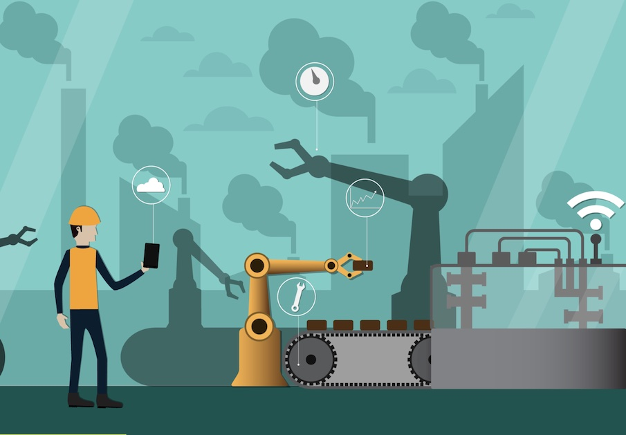

# WHAT IS THE INDUSTRIAL INTERNET of THINGS (IIoT)?

This is the first of a series of articles about the Industrial Internet of Things, and the Internet of Things in general. It is intended to provide and informational backgrdound for decision makers, market movers and end users in general.

You’re probably familiar with the Internet of Things (IoT), at least at a basic level. We’re talking smart refrigerators, fitness trackers, and those home security cameras you can monitor from your phone.

Its enterprise-grade counterpart, the Industrial Internet of Things (IIoT), is perhaps even more impressive, offering game-changing potential through the power of connected machines, sensors, and devices.

So, what is the Industrial Internet of Things? In this article, we’ll take a closer look at IIoT’s meaning, use cases, and how it compares to traditional IoT. Read on to learn more.

    
## FAQ

### What is the Industrial Internet of Things?

Before we dig in too much further, let’s provide an IIoT definition: IIoT, or the Industrial Internet of Things, is a subcategory of IoT that refers to the use of automated, interrelated sensors, devices, and machinery to drive operational efficiency at an industrial scale

IIoT focuses heavily on machine-to-machine (M2M) communication, machine learning, and big data, which enable organizations to unlock access to unprecedented amounts of data and extract insights rapidly. The IIoT encompasses a broad range of industrial-grade applications, from Augmented Reality (AR) devices and connected, collaborative robots, to medical devices, inventory tracking, and predictive maintenance.

Most IIoT definitions highlight that these systems are characterized by a connection between the cyber and the physical—or Information Technology (IT) and Operational Technology (OT).

### How does IIoT work?

Much of the conversation about the Industrial Internet of Things, or Industry 4.0, revolves around predictions and promise. **Big data brings big opportunities**, driving process improvements, cost savings, and a ton of real-world Return On Investment (ROI).

We’ve answered the question “What is IIoT?” but how does it all work?

The IIoT is part of the larger IoT ecosystem, which consists of a network of devices, computers, and objects that collect and transmit data, then send that information to the cloud. That data is then aggregated with other data and managed with software.

Most IIoT systems require data-sharing between multiple devices across several networks including both the cloud (like traditional IoT applications) and the edge. Edge computing optimizes the sensors, computers, and devices used in an IIoT system, bringing the computing closer to the network edge of those items actively producing data for faster processing.

Organizations can capture real-time insights and act at the moment, while captured data can be sent to a centralized cloud system for later analysis. That high-speed processing also allows companies to take spot security threats as they come in, thus reducing points of failure in the system.

### How do we differenciate between IoT and IIoT?

While the Industrial Internet of Things (IIoT) falls under the general IoT umbrella, there are a few differences between the two. The key difference is that IIoT focuses on connecting machines and devices in industries like manufacturing, healthcare, and logistics, while IoT is generally used to describe consumer-level devices like Fitbits and the whole range of smart home devices from ring video doorbells to thermostats and refrigerators.

Aside from the business versus consumer distinction, IIoT comes with much higher stakes than IoT due to its massive scale. When a system fails, downtime can result in life-threatening situations or major financial losses. While personal IoT devices do come with privacy concerns and bring up issues about data collection and consent, it’s unlikely that failure could result in a true emergency situation.

### What are the potential risks of adopting IIoT systems?

While its long list of transformative benefits quickly makes the case for adoption, IIoT is a high-stakes affair. Transformations are expensive, difficult, and can introduce the potential for cyber threats that could have devastating effects in the physical world.

Here’s a look at some of the risks that organizations must prepare for before investing in all of the trappings of the smart factory:

#### Security threats

Many security problems associated with IIoT can be traced back to a lack of basic security protections. Think exposed ports, obsolete software applications, or poor authentication practices.

These vulnerabilities are directly connected to the network, giving bad actors easy access to the entire system. Adding another layer of potential threats into the mix, IIoT systems combine Information Technology (IT) systems with operational technology (OT). This means that security threats move beyond the typical implications of cyberattack, financial losses, data breaches, reputational damage, etc. Instead, what happens in the cyberworld is directly connected to real-world outcomes that, in some cases, could threaten human lives.

#### Data integration

One of the biggest roadblocks to IIoT adoption is data integration. In the context of a factory, you’re looking at a system where there might be thousands of connected sensors and devices, new equipment and software systems, as well as legacy machinery.

While adopting connected smart devices allows organizations to collect more data than ever, poor implementation can easily give way to chaos. For example, sensors made from different manufacturers might come with different software requirements, making it difficult to analyse data on a holistic level. There’s also the issue that older equipment isn’t really designed to collect data, much less format those insights in the same way as modern IIoT tech.

#### High cost of adoption

Of course, there’s also the financial risk of adoption. Organizations preparing for the transformation will need to invest in new software, hardware, and equipment. They’ll also need to consider the costs associated with training their existing workforce and hiring new staff, as well as the amount of time it takes to get those workers at full productivity.

In the long term, IIoT could more than pay for itself; however, many organizations are understandably concerned about investing so much in these new systems upfront.

#### Lack of expertise

IIoT demands expertise in areas that traditionally haven’t been part of the manufacturing, logistics, or energy sectors. These new technologies require expertise in machine learning, data science, and real-time analytics.

### What are the benefits of IIoT in manufacturing and beyond?

According to **Microsoft’s IoT Signals report**, 56% of companies adopt IIoT solutions for operations optimization, 47% cite workforce productivity as their primary use case, and 44% said that safety and security were the driving force behind adoption.

A report from **Dell** found that 49% of manufacturers have achieved improved process performance, while 33% say that they’ve made improvements to their asset utilization. Thirty-six percent of respondents report reductions in downtime.

While manufacturing is clearly leading the charge when it comes to adoption, other industries are embracing the benefits of IIoT, too. Here are a few examples:

* **Pharmaceuticals**. The pharmaceutical automation company **Parata Systems** uses several IIoT technologies to identify the potential uses of its products and their impact on end-users and even makes predictions about how those products will perform.
* **Agriculture**. IIoT is changing the game for agriculture as well. Interconnected sensors can be used to reduce water waste, monitor crops and livestock, track weather patterns to plan for the best possible yields, manage equipment, and more.
* **Retail**. According to Microsoft’s Spotlight on Retail report, retailers are embracing a wide range of IIoT applications. Among adopters, 57% use IoT for store analytics, 48% for supply chain optimization, 46% say security, and 45% say loss prevention.
* **Mining**. IIoT is even shaking up mining. This case study looks at how Dundee Precious Metals used IIoT technologies to increase production by 400%, while creating a safer, knowledge-based workflow.
* **Oil and gas**. Like the manufacturing industry, oil and gas companies can use IoT sensors to manage equipment and predict breakdowns. Additionally, sensors can detect hazards like gas leaks to prevent injury or death among workers and civilians.

### What is IIoT’s role in your business?

IIoT’s transformative benefits are reshaping industries like manufacturing, transportation, and agriculture that have, at least in recent years, lagged behind other sectors. Today, the cost of sensors and analytics software is beginning to fall, while the pressure to increase efficiency is on the rise.

Done right, an IIoT can help organizations optimize their production processes, make data-driven decisions, and drive revenue like never before.

**Zignar Technologies** expert consultants can help you develop an IIoT strategy designed around your organization’s target objectives. Client engagements start with a conversation, allowing us to learn about what you do, how you work, and what problems you’d like to address with IIoT applications. From there, we’ll assess existing systems and processes, define your requirements, and chart your path toward transformation. Contact us today to learn more about our IoT solutions.
